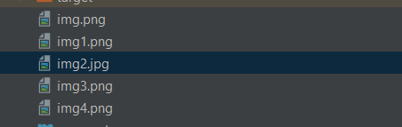
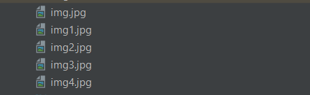
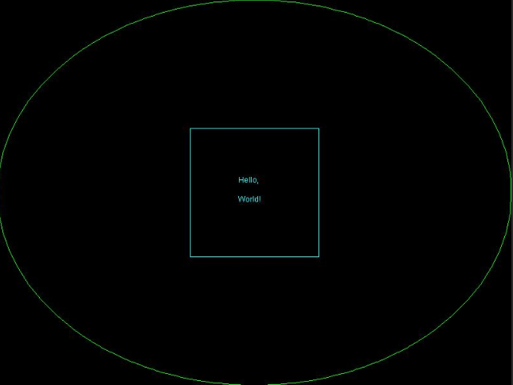
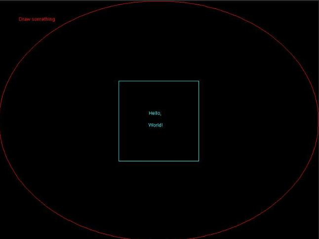
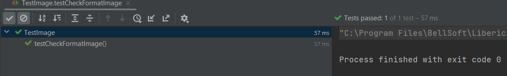

# Обработка изображений на Java

### Певая задача

Нужно написать функцию, которая принимает два формата изображения, и если в текущем каталоге находит изображения первого формата, нужно поменять на второй формат.

### Решение 

Создаем путь нашего кталога. Создаем список файлов, и добавляем файлы нашего каталога в список. С помощью foreach проходим список, и если файл не каталог, то проверяем его формат. Если формат 
равен переданному в параметры первому формату, то читаем это изображение, и формируем его название с новым форматом.
С помощью метода write меняем формат, так как создается новый файл с новым форматом, а старый остается, старый файл удаляем. 

### Вывод

До работы функции

После работы функции

------------------

### Вторая задача

Нужно дополнить вторую функцию, при изменении формата, нужно добавить в центр изображения пустой квадарат,и в это квадрате нужно написать текст (Hello, World!) второе слово нужно написать с новой строки.

### Решение

Сначала открываем холст для рисования. Устанавливаем цвет. Устанавливаем длину стороны квадрата. Рисуем пустой квадарат в центре изображения. И внутри этого квадрата рисуем текст. Закрываем наш холст.

### Вывод 

-------------------

### Тест

Мы проверяем поменялись ли форматы наших изоображений. 

